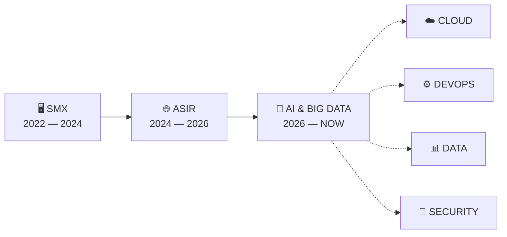
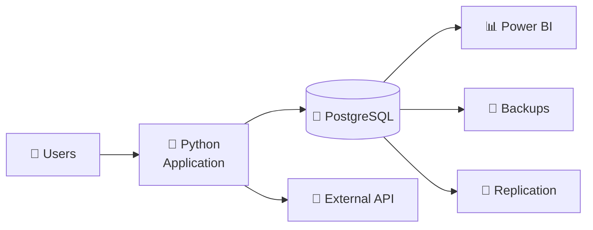
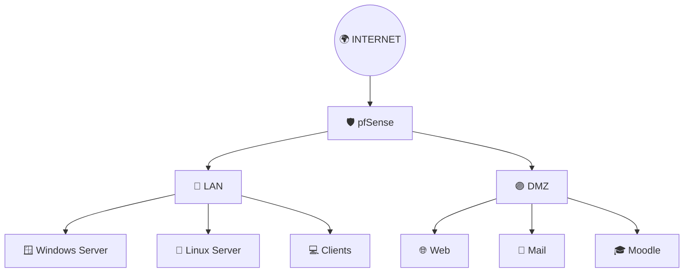

<div align="center">


<br>


<br><br>

<a href="https://ievgensoloviov.github.io/my-portfolio/">

</a>
<a href="https://www.linkedin.com/in/ievgen-soloviov-0709bb299">

</a>
<a href="https://github.com/ievgensoloviov?tab=repositories">

</a>

</div>

---

# `00 // SYSTEM BOOT`

```text
╭─────────────────────────────────────────────────────────────────╮
│                                                                 │
│   IEVGEN.OS                                      BUILD 2026      │
│                                                                 │
├─────────────────────────────────────────────────────────────────┤
│                                                                 │
│   [ OK ] Systems & Networking foundation                        │
│   [ OK ] Técnico SMX                                            │
│   [ OK ] Técnico Superior ASIR                                  │
│   [ OK ] Professional IT experience                             │
│   [RUN ] Artificial Intelligence & Big Data specialization      │
│   [RUN ] Python · Data · Automation                             │
│   [ .. ] Cloud · DevOps · Security · Data Engineering           │
│                                                                 │
│   STATUS  →  BUILDING THE NEXT VERSION                          │
│                                                                 │
╰─────────────────────────────────────────────────────────────────╯
```

<div align="center">

### `systems are my foundation. data & ai are the next layer.`

</div>

---

# `01 // WHO AM I?`

<table>
<tr>
<td width="62%" valign="top">

## 👨‍💻 Ievgen Soloviov

Soy **Técnico Superior en Administración de Sistemas Informáticos en Red**, con una base técnica centrada en **sistemas, redes, infraestructura, servicios, bases de datos y automatización**.

Actualmente estoy cursando un **Curso de Especialización en Inteligencia Artificial y Big Data**, ampliando ese perfil tradicional de infraestructura hacia tecnologías relacionadas con **datos, Python e inteligencia artificial**.

No me interesa limitarme a una sola capa de IT.

Me gusta entender cómo se conecta todo:

**usuario → aplicación → servicio → servidor → red → seguridad → datos**

y cómo podemos automatizarlo, monitorizarlo y hacerlo más eficiente.

</td>

<td width="38%" valign="top">

### `PROFILE.json`

```json
{
  "name": "Ievgen Soloviov",
  "base": "Systems",
  "current": "AI & Big Data",
  "mindset": "Build & Learn",

  "focus": [
    "Cloud",
    "DevOps",
    "Automation",
    "Data",
    "Security"
  ]
}
```

</td>
</tr>
</table>

---

# `02 // EVOLUTION`



<div align="center">

`Hardware & Support` → `Systems & Networks` → `Infrastructure` → `Automation` → `Data & AI`

</div>

---

# `03 // MY TECH UNIVERSE`

<div align="center">

### 🖥️ `INFRASTRUCTURE LAYER`


<br><br>


<br><br>

### 🌐 `NETWORK & SECURITY LAYER`


<br><br>

### ⚙️ `AUTOMATION & DEVOPS LAYER`


<br><br>

`Docker Compose` · `YAML` · `VirtualBox` · `VMware` · `Automation`

<br><br>

### 🧠 `CODE & DATA LAYER`


<br><br>


</div>

---

# `04 // CURRENT PROCESS`

```text
                  IEVGEN // CURRENT LEARNING PIPELINE

        ┌──────────────────────────────────────────────┐
        │          AI & BIG DATA SPECIALIZATION        │
        └─────────────────────┬────────────────────────┘
                              │
              ┌───────────────┼───────────────┐
              │               │               │
              ▼               ▼               ▼
        ┌──────────┐    ┌────────────┐   ┌───────────┐
        │  PYTHON  │    │    DATA    │   │    AI     │
        └────┬─────┘    └─────┬──────┘   └─────┬─────┘
             │                │                │
             ▼                ▼                ▼
        AUTOMATION        DATABASES        INTELLIGENCE
        PROCESSING        ANALYTICS        MODELS
```

### `Now loading...`

```python
current_focus = {
    "education": "Artificial Intelligence & Big Data",
    "building_on": [
        "Systems Administration",
        "Networking",
        "Databases",
        "IT Infrastructure"
    ],
    "learning": [
        "Python",
        "Artificial Intelligence",
        "Big Data",
        "Data Processing",
        "Data Analysis"
    ]
}
```

---

# `05 // PRODUCTION EXPERIENCE`

```text
╭─ PROFESSIONAL.LOG ───────────────────────────────────────────────╮
│                                                                │
│  2025    SERHS                                                 │
│          Service Desk Technician                               │
│          Pineda de Mar                                         │
│                                                                │
│  2023    AJUNTAMENT DE LLORET DE MAR                           │
│          IT Assistant                                          │
│          Lloret de Mar                                         │
│                                                                │
╰────────────────────────────────────────────────────────────────╯
```

<table>
<tr>

<td width="50%" valign="top">

## `ENV_01` 🏢 SERHS

### Service Desk Technician

`06.2025 → 11.2025`

**Corporate IT Environment**

```text
MODE: production
AREA: systems / network / support
```

**Worked with**

↳ Hardware & software incidents  
↳ User support  
↳ Operating systems  
↳ Active Directory  
↳ Device management  
↳ JIRA  
↳ Corporate networking  
↳ Switches & cabling  
↳ Firewall rules  
↳ IT security  

</td>

<td width="50%" valign="top">

## `ENV_02` 🏛️ AJUNTAMENT

### IT Assistant

`04.2023 → 08.2023`

**Public Administration IT**

```text
MODE: production
AREA: support / web / systems
```

**Worked with**

↳ End-user support  
↳ Web administration  
↳ Plone CMS  
↳ HTML / CSS  
↳ Municipal websites  
↳ Content management  
↳ Lloret Smart  
↳ Mobile management systems  

</td>

</tr>
</table>

---

# `06 // FEATURED DEPLOYMENTS`

<div align="center">

## `DEPLOYMENT_01`

# 🏨 Hotel Management Platform

**Application · Database · API · Analytics**


<br><br>


</div>

### Architecture



### What I built

`Bookings` · `Customers` · `Staff` · `Billing` · `PostgreSQL Administration`

`External API Integration` · `Power BI` · `Backups` · `Replication`

`Users & Permissions` · `Database Security` · `Agile / JIRA`

<div align="center">

[](https://drive.google.com/drive/folders/1cHo6X1G8EaBOuPj4vm0Qt2R9xkxh8GaB)

</div>

---

<div align="center">

## `DEPLOYMENT_02`

# 🌐 TechSolutions IS

**Corporate IT Infrastructure**


<br><br>


</div>

### Infrastructure Map



### What I deployed

`Windows Server` · `Ubuntu Server` · `Active Directory`

`LDAP` · `DNS` · `DHCP` · `Mail Server` · `Moodle`

`pfSense` · `LAN / DMZ` · `SSL/TLS`

`RAID 5` · `Automated Backups` · `Incident Management`

<div align="center">

[](https://drive.google.com/drive/folders/1VF-ht9ClLWi4b1KtknwVLrIZdETHP4xI)

</div>

---

# `07 // THE LAB`

<div align="center">

### GitHub is not my storage.

### `It is my technical laboratory.`

</div>

<table>

<tr>

<td align="center" width="25%">

### 🐳

### CONTAINERS

Docker  
Docker Compose  
Services  

</td>

<td align="center" width="25%">

### 🐧

### SYSTEMS

Linux  
Ubuntu Server  
Windows Server  

</td>

<td align="center" width="25%">

### 🌐

### NETWORK

Services  
Infrastructure  
Security  

</td>

<td align="center" width="25%">

### 🧠

### DATA / AI

Python  
Big Data  
Artificial Intelligence  

</td>

</tr>

</table>

<br>

```text
LAB/
│
├── containers/
│   ├── Docker
│   └── Docker Compose
│
├── systems/
│   ├── Linux
│   ├── Ubuntu Server
│   └── Windows Server
│
├── networking/
│   ├── Services
│   ├── Security
│   └── Infrastructure
│
├── streaming/
│   ├── Nginx
│   ├── RTMP
│   └── HLS
│
├── communications/
│   ├── Matrix
│   ├── Synapse
│   └── Element
│
└── intelligence/
    ├── Python
    ├── Big Data
    └── AI
```

---

# `08 // EDUCATION.UPGRADE`

```text
2022
 │
 │   💻 TÉCNICO EN SISTEMAS MICROINFORMÁTICOS Y REDES
 │   Institut Sa Palomera
 │
 ├──────────────────────────────────────────────────────
 │
2024
 │
 │   🌐 TÉCNICO SUPERIOR EN ASIR
 │   Institut Sa Palomera
 │
 │   Systems
 │   Networking
 │   Services
 │   Databases
 │   Security
 │   Virtualization
 │   Automation
 │
 ├──────────────────────────────────────────────────────
 │
2026
 │
 │   🤖 ESPECIALIZACIÓN EN IA & BIG DATA
 │
 │   Artificial Intelligence
 │   Python
 │   Big Data
 │   Data Processing
 │   Data Analysis
 │
 ▼
NOW
```

---

# `09 // TELEMETRY`

<div align="center">


<br>


</div>

> `NOTE:` GitHub language statistics represent public repository activity, not my complete technical experience.

---

# `10 // HUMAN LAYER`

<table>

<tr>

<td width="50%" valign="top">

### 🌍 Languages

```text
Spanish   ██████████  Native
Catalan   ██████████  Native
English   ██████░░░░  B1 / B2
Russian   ██░░░░░░░░  Basic
```

</td>

<td width="50%" valign="top">

### 🧩 How I work

```text
[+] Problem solving
[+] Continuous learning
[+] Technical documentation
[+] Team collaboration
[+] Curiosity
[+] Infrastructure mindset
```

</td>

</tr>

</table>

---

# `11 // NEXT VERSION`

```python
ievgen_vNext = {

    "foundation": {
        "systems": True,
        "networking": True,
        "databases": True,
        "infrastructure": True
    },

    "currently_building": {
        "artificial_intelligence": True,
        "big_data": True,
        "python": True,
        "data": True
    },

    "direction": [
        "Cloud Computing",
        "DevOps",
        "Infrastructure Automation",
        "Cybersecurity",
        "Data Engineering",
        "Artificial Intelligence"
    ],

    "status": "always_learning"
}
```

<div align="center">

### `The goal is not to know one technology.`

### `The goal is to understand how the whole system works.`

</div>

---

# `12 // CONNECT`

<div align="center">

```text
┌───────────────────────────────────────────┐
│                                           │
│         CONNECTION POINTS AVAILABLE       │
│                                           │
└───────────────────────────────────────────┘
```

<a href="https://ievgensoloviov.github.io/my-portfolio/">

</a>

<a href="https://www.linkedin.com/in/ievgen-soloviov-0709bb299">

</a>

<a href="https://github.com/ievgensoloviov">

</a>

<br><br>

```text
ievgen@github:~$ _
```

### `SYSTEMS // INFRASTRUCTURE // AUTOMATION // DATA // AI`


</div>
