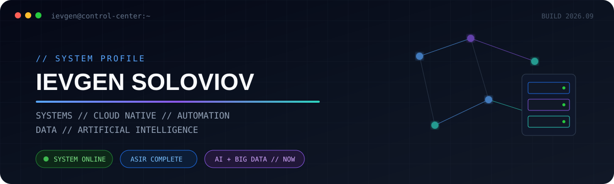
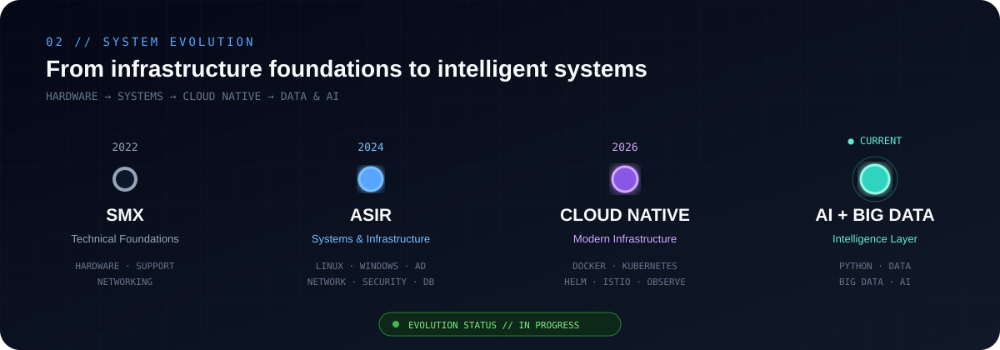
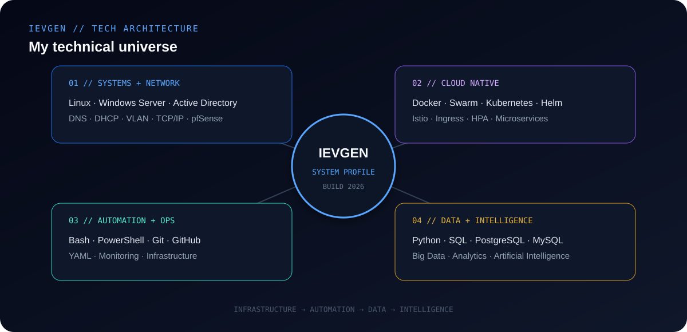
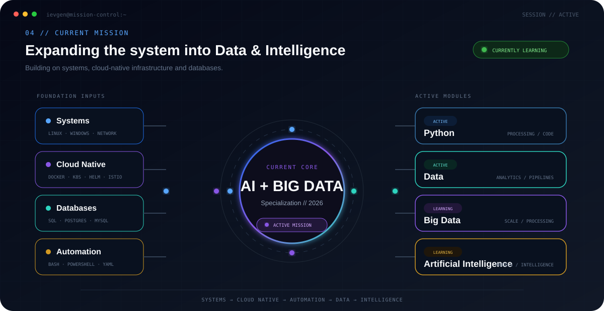
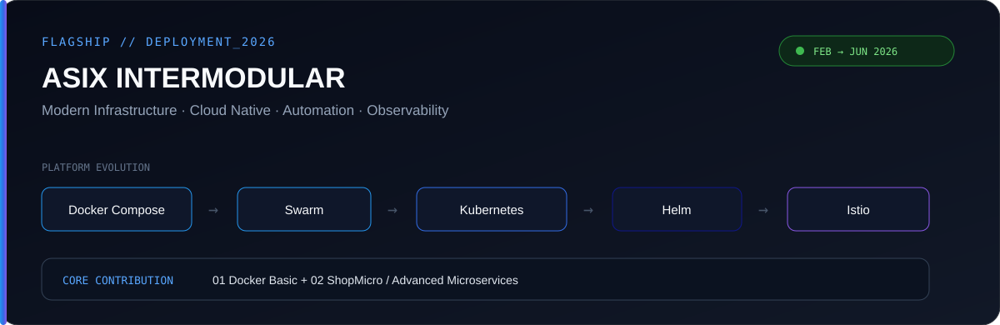
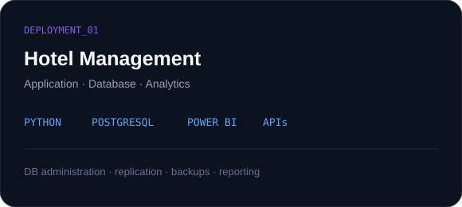
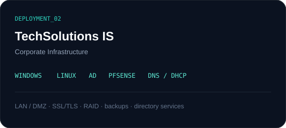
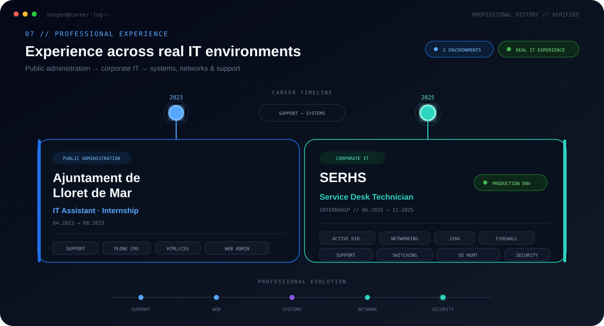
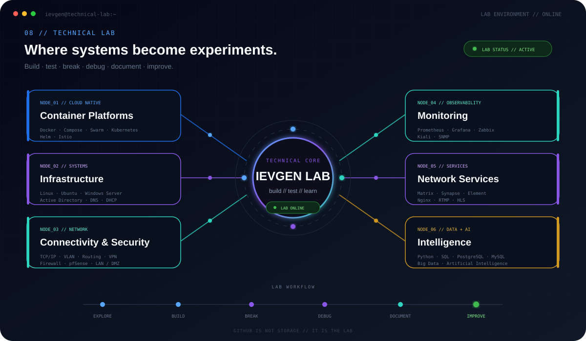
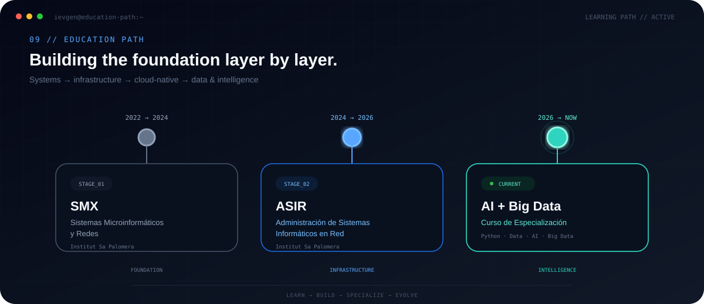

<div align="center">



<br>

<a href="https://ievgensoloviov.github.io/my-portfolio/">

</a>

<a href="https://www.linkedin.com/in/ievgen-soloviov-0709bb299">

</a>

<a href="https://github.com/ievgensoloviov?tab=repositories">

</a>

<br><br>


<br><br>

<sub>
SYSTEMS &nbsp;•&nbsp; CLOUD NATIVE &nbsp;•&nbsp; AUTOMATION &nbsp;•&nbsp; DATA &nbsp;•&nbsp; AI
</sub>

</div>

---

<div align="center">

[ **WHOAMI** ](#01--whoami)
&nbsp;&nbsp;•&nbsp;&nbsp;
[ **JOURNEY** ](#02--journey)
&nbsp;&nbsp;•&nbsp;&nbsp;
[ **STACK** ](#03--technical-architecture)
&nbsp;&nbsp;•&nbsp;&nbsp;
[ **FLAGSHIP** ](#05--flagship)
&nbsp;&nbsp;•&nbsp;&nbsp;
[ **EXPERIENCE** ](#07--experience)
&nbsp;&nbsp;•&nbsp;&nbsp;
[ **LAB** ](#08--the-lab)
&nbsp;&nbsp;•&nbsp;&nbsp;
[ **CONNECT** ](#13--connect)

</div>

---

# `00 // BOOT SEQUENCE`

```text
ievgen@control-center:~$ ./profile --boot

[ OK ] systems_foundation
[ OK ] networking
[ OK ] asir_complete
[ OK ] professional_it_experience
[ OK ] docker_kubernetes_cloud_native

[RUN ] artificial_intelligence
[RUN ] big_data
[RUN ] python_data_automation

STATUS  : ONLINE
MODE    : BUILDING
VERSION : 2026
```

<div align="center">

> **I don't want to understand only one layer.  
> I want to understand how the whole system connects.**

</div>

---

# `01 // WHOAMI`

<table>
<tr>

<td width="62%" valign="top">

## Ievgen Soloviov

**Systems Administrator evolving towards Cloud Native, Data & AI.**

Soy **Técnico Superior en Administración de Sistemas Informáticos en Red**, con una base práctica en sistemas, redes, infraestructura, bases de datos, automatización y soporte IT.

Durante ASIR amplié ese perfil hacia entornos **Cloud Native**, trabajando con tecnologías de contenerización, Kubernetes, microservicios, observabilidad y seguridad.

Actualmente curso una **Especialización en Inteligencia Artificial y Big Data**, conectando esa base de infraestructura con:

`Python` · `Data` · `Big Data` · `Artificial Intelligence`

Mi forma de entender IT:

```text
USER
  ↓
APPLICATION
  ↓
SERVICES
  ↓
CONTAINERS
  ↓
INFRASTRUCTURE
  ↓
NETWORK
  ↓
SECURITY
  ↓
DATA
```

</td>

<td width="38%" valign="top">

### `profile.json`

```json
{
  "name": "Ievgen Soloviov",

  "foundation": {
    "systems": true,
    "networking": true,
    "infrastructure": true
  },

  "layer": "Cloud Native",

  "current": "AI + Big Data",

  "direction": [
    "DevOps",
    "Automation",
    "Data Engineering",
    "AI"
  ],

  "mode": "building"
}
```

</td>

</tr>
</table>

---

# `02 // JOURNEY`

<div align="center">



<br>

<sub>
Technical foundations → systems → modern infrastructure → intelligence
</sub>

</div>

---

# `03 // TECHNICAL ARCHITECTURE`

<div align="center">



<br><br>

### `CORE TECHNOLOGIES`


<br><br>

`Active Directory`
&nbsp;·&nbsp;
`DNS / DHCP`
&nbsp;·&nbsp;
`TCP/IP`
&nbsp;·&nbsp;
`VLAN`
&nbsp;·&nbsp;
`pfSense`
&nbsp;·&nbsp;
`Docker Compose`
&nbsp;·&nbsp;
`Swarm`
&nbsp;·&nbsp;
`Helm`
&nbsp;·&nbsp;
`Istio`
&nbsp;·&nbsp;
`Prometheus`
&nbsp;·&nbsp;
`Grafana`

</div>

---

# `04 // CURRENT MISSION`

<div align="center">



</div>

<details>

<summary><b>▸ Open current learning context</b></summary>

<br>

My current specialization builds on my existing background in:

`Systems Administration` · `Networking` · `Cloud Native` · `Databases` · `Automation`

and expands it towards:

`Python` · `Data Processing` · `Data Analysis` · `Big Data` · `Artificial Intelligence`

</details>

---

# `05 // FLAGSHIP`

<div align="center">



<br>

### `02.2026 → 06.2026`

# ASIX Intermodular

### Modern Infrastructure Project

`Containers` · `Microservices` · `Cloud Native` · `Automation` · `Security` · `Observability`

</div>

<br>

Este proyecto representa uno de los puntos más importantes de mi evolución durante ASIR.

El proyecto completo explora distintas áreas de la administración de sistemas moderna, pero mi trabajo se centró especialmente en:

<table>
<tr>

<td width="50%" align="center">

### `CORE_01`

## Container Evolution

`Docker Compose`

↓

`Docker Swarm`

↓

`Kubernetes`

</td>

<td width="50%" align="center">

### `CORE_02`

## ShopMicro

`Kubernetes`

↓

`Helm`

↓

`Istio`

↓

`Observability`

</td>

</tr>
</table>

---

## `SHOPMICRO // SYSTEM ARCHITECTURE`

<div align="center">


<br>

### `Docker → Swarm → Kubernetes → Helm → Istio`

</div>

<br>

<details>

<summary><b>⚙️ Explore the technical implementation</b></summary>

<br>

### `01 // CONTAINERIZATION`

Arquitectura multicapa inicial:

```text
NGINX
  ↓
PHP-FPM
  ↓
MariaDB
```

Trabajando con:

`Docker Compose` · `multi-container architecture` · `frontend/backend networks` · `persistent volumes`

---

### `02 // DOCKER SWARM`

Evolución hacia orquestación distribuida:

`Services` · `Replicas` · `Overlay Networks` · `Load Balancing` · `Docker Secrets`

---

### `03 // KUBERNETES`

Despliegue declarativo mediante:

`Deployments`

`Services`

`ConfigMaps`

`Secrets`

`Namespaces`

`Ingress`

`StatefulSets`

`Liveness Probes`

`Readiness Probes`

`Requests / Limits`

`Horizontal Pod Autoscaler`

---

### `04 // MICROSERVICES`

ShopMicro incorpora:

```text
PRODUCT SERVICE
ORDER SERVICE
USER SERVICE
```

con una capa de datos y mensajería formada por:

```text
MySQL
Redis
RabbitMQ
```

---

### `05 // HELM`

Gestión del ciclo de vida:

```text
INSTALL
  ↓
UPGRADE
  ↓
VERSION HISTORY
  ↓
ROLLBACK
```

---

### `06 // ISTIO`

Service Mesh para:

`Traffic Control`

`Retries`

`Timeouts`

`Circuit Breakers`

`mTLS`

---

### `07 // OBSERVABILITY`

```text
Prometheus → Metrics
Grafana    → Dashboards
Kiali      → Service topology
```

</details>

<br>

<div align="center">

<a href="https://github.com/ievgensoloviov/asix-projecte-intermodular">

</a>

</div>

---

# `06 // SELECTED SYSTEMS`

<div align="center">

### More systems I've designed, deployed or documented.

</div>

<table>
<tr>

<td width="50%" valign="top">



<br>

### `HOTEL MANAGEMENT PLATFORM`

`Python` · `PostgreSQL` · `Power BI` · `APIs`

Aplicación y plataforma de datos para gestión hotelera.

**Core areas**

Bookings · customers · billing · PostgreSQL administration · API integration · backups · replication · permissions · analytics.

<br>

<a href="https://drive.google.com/drive/folders/1cHo6X1G8EaBOuPj4vm0Qt2R9xkxh8GaB">

</a>

</td>

<td width="50%" valign="top">



<br>

### `TECHSOLUTIONS IS`

`Windows Server` · `Linux` · `AD` · `pfSense`

Diseño y despliegue de infraestructura corporativa.

**Core areas**

Windows/Linux servers · Active Directory · LDAP · DNS/DHCP · pfSense · LAN/DMZ · SSL/TLS · RAID · backups.

<br>

<a href="https://drive.google.com/drive/folders/1VF-ht9ClLWi4b1KtknwVLrIZdETHP4xI">

</a>

</td>

</tr>
</table>

---

# `07 // EXPERIENCE`

<div align="center">



</div>

<details>

<summary><b>▸ Open professional experience details</b></summary>

<br>

<table>
<tr>

<td width="50%" valign="top">

## `ENV_01 // SERHS`

### Service Desk Technician

`06.2025 → 11.2025`

**Corporate IT Environment**

Worked with:

↳ Hardware & software incidents  
↳ On-site and remote support  
↳ Operating systems  
↳ Active Directory  
↳ Device management  
↳ JIRA  
↳ Corporate networking  
↳ Switches & cabling  
↳ Firewall rules  
↳ IT security  

</td>

<td width="50%" valign="top">

## `ENV_02 // AJUNTAMENT`

### IT Assistant

`04.2023 → 08.2023`

**Public Administration IT**

Worked with:

↳ End-user support  
↳ Web administration  
↳ Plone CMS  
↳ HTML / CSS  
↳ Municipal websites  
↳ Content management  
↳ Lloret Smart  
↳ Mobile management systems  

</td>

</tr>
</table>

</details>

---

# `08 // THE LAB`

<div align="center">

### GitHub is not my storage.

## `It is my technical laboratory.`

<br>



</div>

<br>

<details>

<summary><b>▸ Explore laboratory areas</b></summary>

<br>

<table>
<tr>

<td width="33%" valign="top">

### ☸️ Cloud Native

Docker  
Docker Compose  
Docker Swarm  
Kubernetes  
Helm  
Istio  

</td>

<td width="33%" valign="top">

### 🖥️ Systems

Linux  
Ubuntu Server  
Windows Server  
Active Directory  
DNS / DHCP  

</td>

<td width="33%" valign="top">

### 🌐 Network

TCP/IP  
VLAN  
Routing  
Firewalls  
pfSense  
LAN / DMZ  

</td>

</tr>

<tr>

<td width="33%" valign="top">

### 📊 Observability

Prometheus  
Grafana  
Kiali  
Zabbix  
SNMP  

</td>

<td width="33%" valign="top">

### 📡 Services

Matrix  
Synapse  
Element  
Nginx  
RTMP  
HLS  

</td>

<td width="33%" valign="top">

### 🧠 Data + AI

Python  
SQL  
PostgreSQL  
MySQL  
Big Data  
Artificial Intelligence  

</td>

</tr>
</table>

</details>

---

# `09 // EDUCATION`

<div align="center">



</div>

---

# `10 // TELEMETRY`

<div align="center">

### `PUBLIC GITHUB SIGNAL`

<br>


<br><br>


<br>

<sub>
GitHub telemetry represents public repository activity, not the complete scope of my technical experience.
</sub>

</div>

---

# `11 // HUMAN LAYER`

<table>
<tr>

<td width="50%" valign="top">

### `LANGUAGES`

```text
Spanish  ██████████  Native
Catalan  ██████████  Native
English  ██████░░░░  B1 / B2
Russian  ██░░░░░░░░  Basic
```

</td>

<td width="50%" valign="top">

### `OPERATING PRINCIPLES`

```text
[+] learn by building
[+] understand the whole system
[+] document what matters
[+] automate repetitive work
[+] debug before guessing
[+] improve after every iteration
```

</td>

</tr>
</table>

---

# `12 // NEXT SIGNAL`

```text
CURRENT STATE
│
├── Systems Administration       [ STABLE ]
├── Networking                   [ STABLE ]
├── Infrastructure              [ STABLE ]
├── Docker / Kubernetes         [ ACTIVE ]
├── Cloud Native                [ ACTIVE ]
├── Python                      [ BUILDING ]
├── Big Data                    [ BUILDING ]
└── Artificial Intelligence     [ BUILDING ]
```

<div align="center">

### NEXT DIRECTIONS

`Cloud Computing`
&nbsp;&nbsp;•&nbsp;&nbsp;
`DevOps`
&nbsp;&nbsp;•&nbsp;&nbsp;
`Infrastructure Automation`
&nbsp;&nbsp;•&nbsp;&nbsp;
`Cybersecurity`
&nbsp;&nbsp;•&nbsp;&nbsp;
`Data Engineering`
&nbsp;&nbsp;•&nbsp;&nbsp;
`Artificial Intelligence`

<br><br>

> **The goal is not to collect technologies.  
> The goal is to understand how they work together.**

</div>

---

# `13 // CONNECT`

<div align="center">

```text
ievgen@control-center:~$ connection --status

portfolio ........ ONLINE
linkedin ......... ONLINE
github ........... ONLINE

awaiting_next_connection █
```

<br>

<a href="https://ievgensoloviov.github.io/my-portfolio/">

</a>

<a href="https://www.linkedin.com/in/ievgen-soloviov-0709bb299">

</a>

<a href="https://github.com/ievgensoloviov">

</a>

<br><br>

### `SYSTEMS // CLOUD NATIVE // AUTOMATION // DATA // AI`

<sub>
Designed as a technical control center rather than a traditional profile README.
</sub>

<br><br>


</div>
